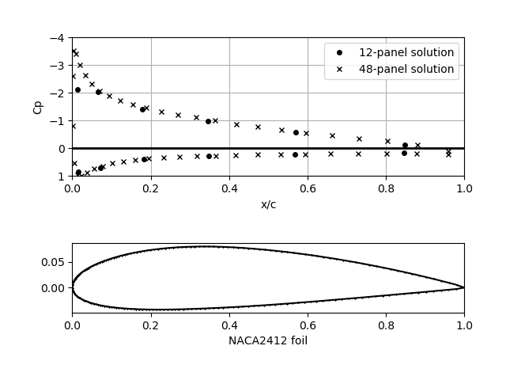

# Airfoil
Computes velocity and pressure coefficient around an airfoil.
Code was translated from (Kuethe & Chow, 1986) p. 134.

# Example use:
```python airfoil.py```
> Example results for NACA2412 Foil 
## 
> Involves the representation of the airfoil with a closed polygon of vortex panels.
Circulation density on each panel varies linearly from one corner to the other and is continuous across the corner.

> The kutta condition is easily incorporated and the computation stable unless a large number of panels is chosen n an airfoil with a cusped trailling edge

## Notes on compiling FORTRAN
The compiler was taken from http://www.mingw.org/. 

## References

Kuethe, Arnold M, and Chuen-Yen Chow. __Foundations of Aerodynamics : Bases of Aerodynamic Design__. 4th ed., J. Wiley, 1986.